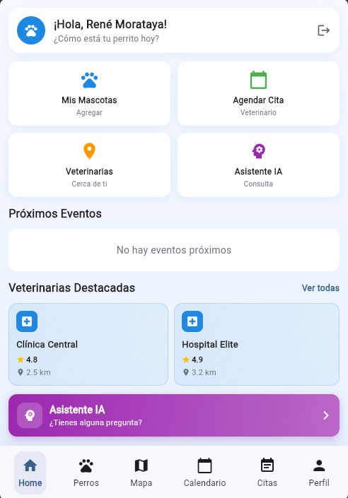
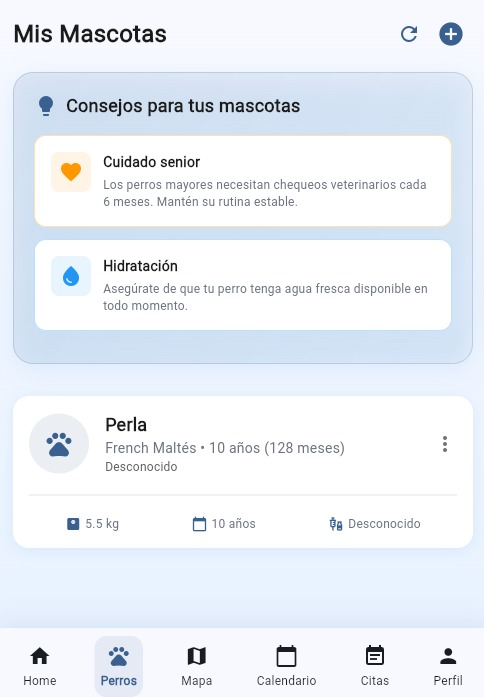
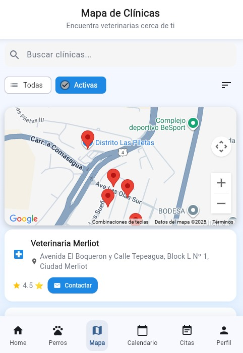
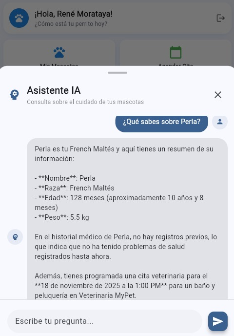
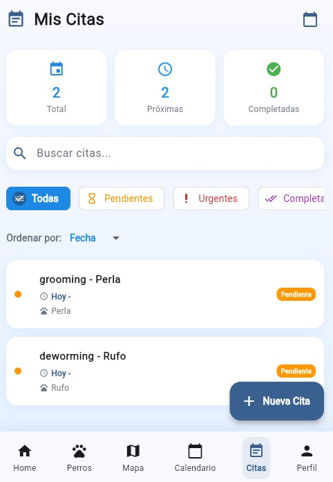

<div align="center">
  
  <h1>🐕 Woofy - Plataforma Integral de Gestión Veterinaria para Mascotas</h1>
</div>

<div align="center">
  
  
  
  
</div>

---

## 📋 Descripción del Proyecto

**Woofy** es una aplicación móvil multiplataforma desarrollada con Flutter que ofrece una solución completa para la gestión y cuidado de mascotas. La aplicación permite a los usuarios gestionar el historial médico de sus mascotas, programar y realizar seguimiento de citas veterinarias, localizar clínicas cercanas mediante geolocalización, y recibir asistencia inteligente mediante un chat con IA especializado en cuidado animal.

El proyecto implementa una arquitectura moderna basada en gestión de estado reactiva, integración con servicios en la nube, y una experiencia de usuario optimizada con soporte para temas claro y oscuro. Está diseñado para ser escalable, mantenible y ofrecer una experiencia fluida tanto en dispositivos Android como iOS.

---

## 📸 Galería

<div align="center">

|                                                                        |                                                                       |                                                                       |
| :--------------------------------------------------------------------: | :-------------------------------------------------------------------: | :-------------------------------------------------------------------: |
|  |  |  |
|   |  |  |

</div>

---

## 🎯 Funcionalidades Principales

### 🏥 Gestión Veterinaria Integral

- **Registro de Mascotas**: Gestión completa del perfil de cada mascota con información detallada
- **Historial Médico**: Registro y seguimiento de vacunas, tratamientos y eventos médicos
- **Sistema de Citas**: Programación, gestión y seguimiento de citas veterinarias con estados (programada, confirmada, completada)
- **Calendario Integrado**: Visualización y gestión de citas en un calendario interactivo
- **Recordatorios Automáticos**: Sistema de notificaciones para no olvidar citas importantes

### 🗺️ Localización y Navegación

- **Mapa de Clínicas Veterinarias**: Integración con Google Maps para visualizar clínicas cercanas
- **Geolocalización**: Búsqueda de veterinarias basada en la ubicación del usuario
- **Rutas y Direcciones**: Cálculo de rutas hacia clínicas seleccionadas
- **Filtros Avanzados**: Búsqueda por especialidad, calificaciones y distancia

### 🤖 Asistente Inteligente

- **Chat con IA**: Asistente virtual especializado en cuidado de mascotas
- **Consultas Contextuales**: Respuestas personalizadas basadas en el historial de la mascota
- **Conversaciones Persistentes**: Historial de conversaciones guardado en la nube

### 👤 Gestión de Usuario

- **Autenticación Segura**: Sistema de autenticación con Supabase Auth
- **Perfil Personalizable**: Configuración de preferencias de usuario
- **Temas Adaptativos**: Soporte para modo claro y oscuro con persistencia de preferencias
- **Sincronización en la Nube**: Datos sincronizados automáticamente entre dispositivos

---

## 🛠️ Stack Tecnológico

### Frontend & Framework

- **Flutter 3.x**: Framework multiplataforma para desarrollo móvil
- **Dart 3.9.0**: Lenguaje de programación moderno y tipado estáticamente
- **Material Design**: Sistema de diseño de Google para interfaces consistentes

### Gestión de Estado

- **Riverpod 2.4.9**: Gestión de estado reactiva y declarativa
- **Riverpod Generator 2.3.9**: Generación automática de código para providers

### Backend & Base de Datos

- **Supabase 2.10.1**: Backend as a Service (BaaS) con PostgreSQL
  - Autenticación y autorización de usuarios
  - Base de datos relacional en tiempo real
  - Almacenamiento seguro de datos

### Navegación

- **Go Router 12.1.3**: Sistema de navegación declarativa y type-safe

### Servicios de Ubicación

- **Google Maps Flutter 2.14.0**: Integración de mapas interactivos
- **Geolocator 14.0.2**: Obtención de ubicación GPS del dispositivo
- **Flutter Polyline Points 3.1.0**: Cálculo de rutas y polilíneas en mapas

### Almacenamiento

- **SharedPreferences 2.2.2**: Almacenamiento local de preferencias
- **Flutter Secure Storage 9.2.2**: Almacenamiento seguro de credenciales y tokens

### Comunicación

- **HTTP 1.3.0**: Cliente HTTP para comunicación con APIs REST
- **Flutter Dotenv 5.1.0**: Gestión de variables de entorno y configuración

### Herramientas de Desarrollo

- **Build Runner 2.4.7**: Generación de código para Riverpod
- **Flutter Lints 5.0.0**: Análisis estático de código y mejores prácticas
- **Flutter Launcher Icons 0.13.1**: Generación automática de iconos de aplicación

---

## 🏗️ Arquitectura del Proyecto

El proyecto sigue una arquitectura modular y escalable:

```
lib/
├── config/              # Configuraciones globales y utilidades
│   ├── app_config.dart
│   ├── environment.dart
│   └── theme_utils.dart
├── models/              # Modelos de datos y entidades
│   ├── pet_model.dart
│   ├── appointment_model.dart
│   ├── clinic_model.dart
│   ├── ai_chat_model.dart
│   └── ...
├── providers/           # Gestión de estado con Riverpod
│   ├── pet_provider.dart
│   ├── appointment_provider.dart
│   ├── auth_provider.dart
│   ├── theme_provider.dart
│   └── ...
├── services/            # Lógica de negocio y comunicación con APIs
│   ├── pet_service.dart
│   ├── appointment_service.dart
│   ├── auth_service.dart
│   ├── ai_chat_service.dart
│   └── ...
├── screens/             # Interfaces de usuario
│   ├── home/
│   ├── pets/
│   ├── appointments/
│   ├── calendar/
│   ├── map/
│   ├── profile/
│   └── auth/
├── router/              # Configuración de navegación
│   └── app_router.dart
└── theme/               # Temas y estilos
    └── app_theme.dart
```

---

## 🚀 Características Técnicas Destacadas

### ✨ Gestión de Estado Reactiva

- Implementación de Riverpod para gestión de estado eficiente y predecible
- Providers generados automáticamente para reducir código boilerplate
- Estado sincronizado entre componentes de forma reactiva

### 🔐 Seguridad y Autenticación

- Autenticación segura mediante Supabase Auth
- Almacenamiento encriptado de credenciales con Flutter Secure Storage
- Gestión de tokens y sesiones de usuario

### 📱 Experiencia de Usuario

- Diseño responsivo adaptado a diferentes tamaños de pantalla
- Soporte nativo para temas claro y oscuro
- Animaciones fluidas y transiciones suaves
- Navegación intuitiva con Go Router

### 🌐 Integración con Servicios Externos

- Integración completa con Google Maps API
- Sincronización en tiempo real con Supabase
- Comunicación RESTful con servicios backend

### 🎨 Personalización

- Sistema de temas completamente personalizable
- Persistencia de preferencias de usuario
- Configuración adaptable según el dispositivo

---

## 📱 Plataformas Soportadas

- ✅ **Android** (SDK mínimo: 21)
- ✅ **iOS**
- ✅ **Web** (en desarrollo)
- ✅ **Windows** (en desarrollo)
- ✅ **macOS** (en desarrollo)
- ✅ **Linux** (en desarrollo)

---

## 🔧 Requisitos Previos

- Flutter SDK 3.0 o superior
- Dart SDK 3.9.0 o superior
- Android Studio / VS Code con extensiones de Flutter
- Cuenta de Supabase (para backend y base de datos)
- API Key de Google Maps (para funcionalidad de mapas)

---

## 📦 Instalación

1. **Clonar el repositorio**

   ```bash
   git clone https://github.com/tu-usuario/woofyapp.git
   cd woofyapp
   ```

2. **Instalar dependencias**

   ```bash
   flutter pub get
   ```

3. **Configurar variables de entorno**

   - Crear archivo `.env` en la raíz del proyecto
   - Configurar credenciales de Supabase y Google Maps

4. **Ejecutar la aplicación**
   ```bash
   flutter run
   ```

---

## 🎓 Aprendizajes y Competencias Desarrolladas

Este proyecto demuestra competencias en:

- **Desarrollo Mobile**: Desarrollo multiplataforma con Flutter
- **Arquitectura de Software**: Diseño modular y escalable
- **Gestión de Estado**: Implementación de patrones reactivos
- **Integración de APIs**: Comunicación con servicios REST y BaaS
- **Geolocalización**: Implementación de mapas y servicios de ubicación
- **UI/UX**: Diseño de interfaces intuitivas y accesibles
- **Seguridad**: Implementación de autenticación y almacenamiento seguro
- **Base de Datos**: Diseño y gestión de esquemas relacionales
